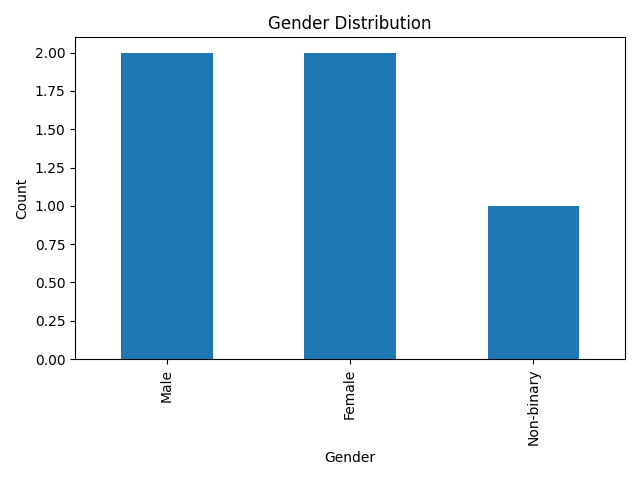
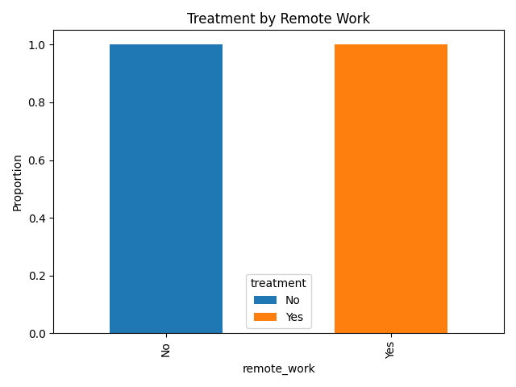
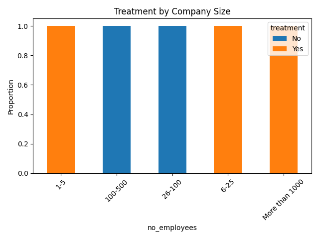

# Mental Health in Tech - Data Analysis Project

## Overview
This project analyzes mental health survey data in the tech industry using Python.  
It explores trends related to gender, company size, and remote work.

## Key Visualizations

### Gender Distribution

### Treatment by Remote Work

### Treatment by Company Size

## Tools Used
- Python (pandas, matplotlib)
- Jupyter Notebook

## Process
1. Data cleaning and preprocessing
2. Exploratory Data Analysis (EDA)
3. Data visualization and interpretation

## Key Findings
- Remote workers are more likely to seek help, but also report higher isolation
- Small companies offer fewer mental health resources than large ones

## Files
- `mental_health_analysis.py`: Main notebook with code
- `README.md`: This file

---

**Created by Jiaer Shao | August 2025**
